<!-- banner.svg lives in this same repo (YADUNANDAN-SINGH/YADUNANDAN-SINGH), next to this README -->

  

**systems · machine learning · bitcoin protocol** — self-taught, Jammu, India

[portfolio](https://yadunandan-singh.pages.dev/) · [medium](https://medium.com/@yadunandan-ai-dev) · [linkedin](https://www.linkedin.com/in/yadunandan-singh-ai-dev/) · [email](mailto:yadunandansingh105@gmail.com)

 

## The rule

**No black boxes.** If I haven't built it once from first principles, I don't get to `import` it.

That one rule produced everything below.

| The black box | What I built instead |
|:--|:--|
| `np.linalg.svd` | **[Image Compressor from Scratch](https://github.com/YADUNANDAN-SINGH/Image_Compression_via_Low-Rank_Matrix-_Approximation)** — SVD assembled by hand from the eigendecomposition of AᵀA, then pointed at lossy image compression with a live quality slider: drag `k`, watch the rank drop. `python` `numpy` `flask` |
| A recommender API on someone's server | **[GlassBox](https://github.com/YADUNANDAN-SINGH/GlassBox-Rust-SVD-recommendation-system)** — the entire recommendation engine (SVD, database, UI) compiled to WebAssembly and running in *your* browser tab. Embedded SurrealDB over IndexedDB; zero servers, zero telemetry. `rust` `leptos` `surrealdb` `wasm` |
| LangChain | **[Prism-RAG](https://github.com/YADUNANDAN-SINGH/Prism-RAG)** — a RAG pipeline with the lid off: a hand-rolled in-memory vector database in Rust (cosine similarity over 384-d embeddings), and a 3-panel UI that shows every retrieved chunk and the exact assembled prompt before a local LLM streams a single token. `rust · axum` `python` `react` `ollama` `docker` |
| "just ask an LLM to do the math" | **[Neuro-Symbolic Solver](https://github.com/YADUNANDAN-SINGH/Neuro-Symbolic-Solver)** — a CNN reads the handwritten expression; a deterministic evaluator computes the answer. The neural net does perception, the math does math — nothing gets to hallucinate arithmetic. `tensorflow` `opencv` `fastapi` `react` |
| The password field | **[FaceAuth Notes](https://github.com/YADUNANDAN-SINGH/django-svd-face-auth)** — Eigenfaces written out from the linear algebra (mean face → centered matrix → SVD → projection weights) and wired in as the actual login for a Django notes app, with auto-augmented training shots per user. `django` `opencv` `numpy` `docker` |
| Wallet SDKs | **[bitcoin-wallet-rs](https://github.com/YADUNANDAN-SINGH/bitcoin-wallet-rs)** — key generation, wallet persistence, UTXO discovery and raw unsigned-transaction construction on signet, built directly on `secp256k1` and `rust-bitcoin` primitives. Signing is next. `rust` `secp256k1` `signet` |

## Merged upstream

Anyone can push to their own repos. These went through someone else's review.

- 🟣 **c2siorg / DataLoom** — [#383](https://github.com/c2siorg/DataLoom/pull/383) preview-before-persist flow for row-reducing transforms, so users validate output before it ever hits the pipeline
- 🟣 **c2siorg / DataLoom** — [#348](https://github.com/c2siorg/DataLoom/pull/348) fixed strict case-sensitivity in string filtering, plus NaN handling, dtype checks, and test coverage
- 🟣 **c2siorg / TensorMap** — [#367](https://github.com/c2siorg/TensorMap/pull/367) fixed a FastAPI 500 by repairing NaN → JSON serialization in dataset preview
- 🟢 **in review** — [#410](https://github.com/c2siorg/DataLoom/pull/410) extends the apply-preview workflow across DataLoom's entire transform layer (11+ modules)

<b>The archive</b> — earlier builds, same habit

 

- **[YouTube Recommender with SVD](https://github.com/YADUNANDAN-SINGH/YouTube-video-recommendation-model-with-SVD)** — TF-IDF + TruncatedSVD taste vectors built from videos you liked *and* the ones you hated. CLI + Flask UI. The project that started the whole SVD obsession.
- **[Geometric Transformation Visualizer](https://github.com/YADUNANDAN-SINGH/Geometric-Transformation-Visualizer-)** — type any 2×2 matrix, watch the plane move. Built to make MIT 18.06 tangible; determinant-as-area included.
- **[AI Image Recognition Webapp](https://github.com/YADUNANDAN-SINGH/AI-Image-Recognition-webapp)** — a custom CNN trained on CIFAR-10 behind a drag-and-drop Flask frontend, with top-3 confidence scores.
- **[Delhi-NCR Property Price Predictor](https://github.com/YADUNANDAN-SINGH/Delhi-NCR-property-price-predictor)** — auto-cleaning pipeline for messy real-estate listings plus a model bake-off, shipping the winner as a pickled artifact.

## Writing

- **[Should You Be Scared of Agentic AI?](https://medium.com/@yadunandan-ai-dev/should-you-be-scared-of-agentic-ai-heres-the-reality-189088104d78)** — where agents actually stand, minus the panic
- **[Don't Be a Dumb Computer: SVD Explained](https://medium.com/@yadunandan-ai-dev/dont-be-a-dumb-computer-svd-explained-subtitle-i-built-a-youtube-recommender-to-finally-155eabfbcbe6)** — the recommender that finally made SVD click. Built first, written after.
- **[I Stopped Solving Problems and Built a Tool Instead](https://medium.com/@yadunandan-ai-dev/i-stopped-solving-problems-and-built-a-tool-instead-how-a-visualizer-taught-me-real-linear-algebra-17ea52847001)** — how shipping a visualizer taught more linear algebra than the problem sets
- **[Build Your Own Image Recognition Model](https://medium.com/@yadunandan-ai-dev/how-can-you-build-your-own-image-recognition-model-as-your-first-ai-project-090a20c3ec3e)** — a first AI project, end to end

## Now

- Shipping the apply-preview workflow across DataLoom's whole transform layer — [c2siorg #410](https://github.com/c2siorg/DataLoom/pull/410), in review
- IIT Madras — BS in Data Science & Applications, qualifier July 2026
- The long game: GSoC, Summer of Bitcoin, and a signed transaction on signet

## Numbers

 

The banner above is a hand-written SVG. Of course it is.

