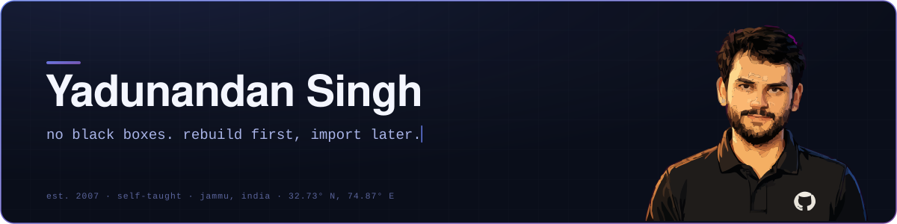

<!-- banner.svg lives in this same repo (YADUNANDAN-SINGH/YADUNANDAN-SINGH), next to this README -->

  

### AI Engineer — retrieval, agents, and the math underneath

I build the layers most people import: vector stores, SVD, inference plumbing, wallet primitives.
Self-taught · Jammu, India · IIT Madras BS in Data Science

[**Portfolio**](https://yadunandan-singh.pages.dev/) · [**Writing**](https://medium.com/@yadunandan-ai-dev) · [**LinkedIn**](https://www.linkedin.com/in/yadunandan-singh-ai-dev/) · [**Email**](mailto:yadunandansingh105@gmail.com)

 

 

## The rule

**No black boxes.** If I haven't built it once from first principles, I don't get to `import` it.

That one rule produced everything below.

 

## AI systems

LLM-shaped work where the interesting part is what happens *before* the model is called — retrieval, grounding, and knowing which component is allowed to be wrong.

| | |
|:--|:--|
| **[Prism-RAG](https://github.com/YADUNANDAN-SINGH/Prism-RAG)** `rust · axum` `python` `react` `ollama` `docker` | A RAG pipeline with the lid off. Hand-rolled in-memory vector database in Rust (cosine similarity over 384-d embeddings), and a 3-panel UI that shows every retrieved chunk and the exact assembled prompt *before* a local LLM streams a single token. Built instead of importing LangChain. |
| **[Lara — the agent on my portfolio](https://yadunandan-singh.pages.dev/)** `react` `django` `python` | The site ships its own agent. Ask Lara about a project and she answers from a grounded knowledge base; ask for a résumé and she generates one targeted at the role you name. Merged-PR counts on the page are pulled live from the GitHub API, so the site can't quietly go stale. |
| **[Neuro-Symbolic Solver](https://github.com/YADUNANDAN-SINGH/Neuro-Symbolic-Solver)** `tensorflow` `opencv` `fastapi` `react` | A CNN reads the handwritten expression; a deterministic evaluator computes the answer. The neural net does perception, the math does math — nothing gets to hallucinate arithmetic. |
| **[GlassBox](https://github.com/YADUNANDAN-SINGH/GlassBox-Rust-SVD-recommendation-system)** `rust` `leptos` `surrealdb` `wasm` | The entire recommendation engine — SVD, database, UI — compiled to WebAssembly and running in *your* browser tab. Embedded SurrealDB over IndexedDB. Zero servers, zero telemetry, zero inference bill. |

 

## Foundations, rebuilt by hand

The ML primitives, written out from the linear algebra rather than called.

| The black box | What I built instead |
|:--|:--|
| `np.linalg.svd` | **[Image Compressor from Scratch](https://github.com/YADUNANDAN-SINGH/Image_Compression_via_Low-Rank_Matrix-_Approximation)** — SVD assembled by hand from the eigendecomposition of AᵀA, then pointed at lossy image compression with a live quality slider: drag `k`, watch the rank drop. `python` `numpy` `flask` |
| The password field | **[FaceAuth Notes](https://github.com/YADUNANDAN-SINGH/django-svd-face-auth)** — Eigenfaces written out from the linear algebra (mean face → centered matrix → SVD → projection weights) and wired in as the actual login for a Django notes app, with auto-augmented training shots per user. `django` `opencv` `numpy` `docker` |
| Wallet SDKs | **[bitcoin-wallet-rs](https://github.com/YADUNANDAN-SINGH/bitcoin-wallet-rs)** — key generation, wallet persistence, UTXO discovery and raw unsigned-transaction construction on signet, built directly on `secp256k1` and `rust-bitcoin` primitives. Signing is next. `rust` `secp256k1` `signet` |

 

## Merged upstream

Anyone can push to their own repos. These went through someone else's review.

**12 merged pull requests** across two [c2siorg](https://github.com/c2siorg) projects — 11 in DataLoom, 1 in TensorMap.

- **DataLoom [#455](https://github.com/c2siorg/dataloom/pull/455)** — moved linting off `pull_request_target` and onto `pull_request` + `workflow_run`, so fork PRs get linted without handing them a privileged token
- **DataLoom [#410](https://github.com/c2siorg/dataloom/pull/410)** — extended the apply-preview workflow across DataLoom's entire transform layer (11+ modules)
- **DataLoom [#383](https://github.com/c2siorg/dataloom/pull/383)** — preview-before-persist flow for row-reducing transforms, so users validate output before it ever hits the pipeline
- **DataLoom [#348](https://github.com/c2siorg/dataloom/pull/348)** — fixed strict case-sensitivity in string filtering, plus NaN handling, dtype checks, and test coverage
- **TensorMap [#367](https://github.com/c2siorg/tensormap/pull/367)** — fixed a FastAPI 500 by repairing NaN → JSON serialization in dataset preview

<b>The other seven</b> — features and fixes, same repos

 

- **DataLoom [#472](https://github.com/c2siorg/dataloom/pull/472)** — edit button and modal on dataset cards, so renaming a dataset no longer means leaving the home screen
- **DataLoom [#470](https://github.com/c2siorg/dataloom/pull/470)** — export rendered charts and the correlation matrix as PNG
- **DataLoom [#467](https://github.com/c2siorg/dataloom/pull/467)** — live password-strength meter on the password-creation forms
- **DataLoom [#460](https://github.com/c2siorg/dataloom/pull/460)** — quick theme toggle in the top navbar
- **DataLoom [#458](https://github.com/c2siorg/dataloom/pull/458)** — instant hover tooltips on the MenuNavbar buttons and tabs
- **DataLoom [#453](https://github.com/c2siorg/dataloom/pull/453)** — real dark-mode styling for the Quality tab and assessment panel
- **DataLoom [#408](https://github.com/c2siorg/dataloom/pull/408)** — hover tooltips on the toolbar icons (the first one — a small fix, deliberately)

<b>The archive</b> — earlier builds, same habit

 

- **[YouTube Recommender with SVD](https://github.com/YADUNANDAN-SINGH/YouTube-video-recommendation-model-with-SVD)** — TF-IDF + TruncatedSVD taste vectors built from videos you liked *and* the ones you hated. CLI + Flask UI. The project that started the whole SVD obsession.
- **[Geometric Transformation Visualizer](https://github.com/YADUNANDAN-SINGH/Geometric-Transformation-Visualizer-)** — type any 2×2 matrix, watch the plane move. Built to make MIT 18.06 tangible; determinant-as-area included.
- **[AI Image Recognition Webapp](https://github.com/YADUNANDAN-SINGH/AI-Image-Recognition-webapp)** — a custom CNN trained on CIFAR-10 behind a drag-and-drop Flask frontend, with top-3 confidence scores.
- **[Delhi-NCR Property Price Predictor](https://github.com/YADUNANDAN-SINGH/Delhi-NCR-property-price-predictor)** — auto-cleaning pipeline for messy real-estate listings plus a model bake-off, shipping the winner as a pickled artifact.

 

## Writing

Every article is downstream of something I actually shipped.

- **[Stop Vibe Coding](https://medium.com/@yadunandan-ai-dev/stop-vibe-coding-how-elite-developers-actually-use-ai-backed-by-real-research-da32f95c0039)** — spec-driven AI development, and what separates it from trusting the output because it *felt* right
- **[Should You Be Scared of Agentic AI?](https://medium.com/@yadunandan-ai-dev/should-you-be-scared-of-agentic-ai-heres-the-reality-189088104d78)** — where agents actually stand, minus the panic
- **[ChatGPT Failed My Sister's Live Class, So I Built a Neuro-Symbolic Math Solver](https://medium.com/@yadunandan-ai-dev/chatgpt-failed-my-sisters-live-class-so-i-built-a-neuro-symbolic-ai-math-solver-from-scratch-38a809494b67)** — why perception and arithmetic should be two different components
- **[How to Find Your First Open Source Project in One Evening](https://medium.com/@yadunandan-ai-dev/how-to-find-your-first-open-source-project-in-one-evening-ab936a19d9dd)** — the method behind the merged PRs above: choose on maintainer responsiveness and community tone, not stars
- **[Don't Be a Dumb Computer: SVD Explained](https://medium.com/@yadunandan-ai-dev/dont-be-a-dumb-computer-svd-explained-subtitle-i-built-a-youtube-recommender-to-finally-155eabfbcbe6)** — the recommender that finally made SVD click. Built first, written after.
- **[I Stopped Solving Problems and Built a Tool Instead](https://medium.com/@yadunandan-ai-dev/i-stopped-solving-problems-and-built-a-tool-instead-how-a-visualizer-taught-me-real-linear-algebra-17ea52847001)** — how shipping a visualizer taught more linear algebra than the problem sets
- **[Build Your Own Image Recognition Model](https://medium.com/@yadunandan-ai-dev/how-can-you-build-your-own-image-recognition-model-as-your-first-ai-project-090a20c3ec3e)** — a first AI project, end to end

 

## Now

- **IIT Madras** — BS in Data Science & Applications, qualifier July 2026
- **Open source** — contributing to [c2siorg/DataLoom](https://github.com/c2siorg/DataLoom) and [c2siorg/TensorMap](https://github.com/c2siorg/TensorMap); 12 PRs merged so far
- **Next up** — the signing path in `bitcoin-wallet-rs`; a signed transaction on signet is the milestone

 

## Numbers

 

The banner above is a hand-written SVG. Of course it is.

